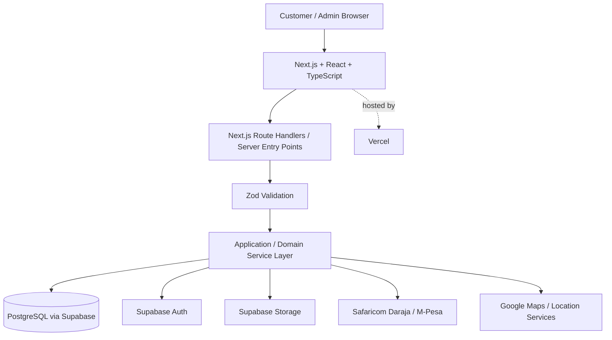

# Nakuru Hardware Commerce Platform — Technical Architecture

| Field                | Value                              |
| -------------------- | ---------------------------------- |
| Repository           | Axiomwriters/Hardware-E-Shop       |
| Document             | `docs/architecture.md`             |
| Version              | 1.0                                |
| Status               | PROPOSED — PENDING TEAM APPROVAL   |
| Scope                | V1                                 |
| Audience             | Project Partner, Developer A — Kelvin Njau (Data/Platform), Developer B — Brian Yegon (Application/Integrations), Frontend/Product |

**Purpose of this document:** establish the technical contract that all
developers agree to before substantial implementation begins. Once approved,
this document is the V1 technical source of truth. Any material change must be
documented through an ADR or an explicit architecture update.

---

## 1. Architecture Decision Status

This document is not considered approved merely because it exists in Git.

Before implementation proceeds beyond the repository foundation, the team must
review and explicitly approve the architecture.

### Approval checklist

- [ ] Project Partner reviewed
- [ ] Developer A — Data / Platform reviewed
- [ ] Developer B — Application / Integrations reviewed
- [ ] Frontend / Product reviewed
- [ ] No unresolved P0 architectural decision remains
- [ ] Database ownership is agreed
- [ ] Business-logic boundaries are agreed
- [ ] Authentication, authorization and RLS responsibilities are agreed
- [ ] API contract conventions are agreed
- [ ] Order, payment and inventory state rules are agreed
- [ ] Environment and secret-management rules are agreed
- [ ] Developer boundaries are agreed
- [ ] First implementation slice is agreed

### Sign-off

| Role                                  | Name        | Approval      | Date |
| ------------------------------------- | ----------- | ------------- | ---- |
| Project Partner                       | TBD         | [ ] Approved  | TBD  |
| Developer A — Data / Platform         | Kelvin Njau | [ ] Approved  | TBD  |
| Developer B — Application / Integrations | Brian Yegon | [ ] Approved | TBD  |
| Frontend / Product                    | TBD         | [ ] Approved  | TBD  |

**Implementation gate:** core backend implementation should not proceed while a
P0 architectural decision remains unresolved.

---

## 2. Product and V1 Architectural Context

The platform is a mobile-first local hardware commerce platform for Nakuru
County, Kenya.

### Primary users

- Homeowners
- Landlords
- Professional fundis
- Contractors

### V1 North Star

**Confirmed hardware orders per week.**

The architecture therefore optimizes for a reliable transaction path rather than
for a generic catalogue, social platform, marketplace, or feature collection.

### V1 success condition

A customer can:

- discover a product or submit a material request;
- configure/select the required items or receive a quote;
- complete checkout or accept a quote;
- make payment;
- receive an authoritative order confirmation;

and the business can process and fulfill the order.

### V1 commerce paths

**Standard commerce**

```
Discover → Product → Cart → Delivery → Review → Payment → Confirmed Order → Fulfillment → Tracking
```

**Assisted procurement**

```
Material Request → Admin Review → Quote → Customer Acceptance → Payment → Order/Fulfillment → Tracking
```

### Explicit V1 non-goals

The following are outside the V1 architecture unless the team makes a documented
scope decision:

- Multi-vendor marketplace
- Native mobile applications
- Fundi marketplace
- Contractor bidding/tendering
- AI procurement assistant
- Live driver GPS
- Fleet management
- Loyalty programme
- Customer social/review system
- Financing/loans
- Multi-branch inventory
- ERP/accounting integrations
- Advanced analytics
- Automated supplier procurement

---

## 3. Architectural Principles

These principles govern implementation and code review.

### 3.1 Server authority

The client requests an action. The server determines whether the action is
valid, calculates authoritative values, performs the transaction, and persists
the result.

The browser must never be trusted as the authority for:

- product price;
- stock availability;
- order totals;
- delivery fees;
- customer ownership;
- authorization;
- payment status;
- order status;
- inventory mutation;
- quote validity;
- fulfillment state.

### 3.2 Single source of truth

- PostgreSQL is the authoritative system of record for relational business state.
- Frontend state is a presentation/cache layer, not the source of truth.
- External systems are authoritative only for the facts they own. For example,
  Daraja/M-Pesa is the external payment rail; the platform must validate and
  persist the payment result in its own database.

### 3.3 Defense in depth

Security is layered:

```
Authentication → Authorization → RLS / database enforcement → Transactional business rules
```

No single layer is treated as sufficient for every operation.

### 3.4 Explicit state machines

Orders, payments, quotes and fulfillment must use explicit states and permitted
transitions. Invalid transitions are rejected server-side.

### 3.5 Idempotency for money and state-changing operations

Retries are expected in distributed systems. Repeating a request must not create
duplicate orders, payments, inventory decrements, or state transitions.

### 3.6 Reversible implementation, controlled architecture

Normal implementation details may evolve. Changes to core contracts — database
boundaries, security model, payment semantics, state machines, or service
boundaries — require explicit review and, where material, an ADR.

### 3.7 Keep V1 boring where possible

Prefer simple, observable, well-tested primitives over premature microservices,
event buses, distributed workflows, or infrastructure that V1 does not need.

---

## 4. System Architecture

### 4.1 High-level architecture



### 4.2 Layer responsibilities

| Layer                        | Responsibility                                    | Must not own                                          |
| ---------------------------- | ------------------------------------------------- | ----------------------------------------------------- |
| UI / React                   | Presentation, interaction, client state, UX       | Authoritative prices, stock, payment or order decisions |
| Route Handler / server entry point | HTTP boundary, auth context, input parsing, response mapping | Large domain workflows                  |
| Zod                          | Request/input shape validation                    | Authorization, inventory integrity, payment confirmation |
| Service / domain layer       | Business rules, orchestration, transactions, state transitions | UI rendering                               |
| Data access                  | Database reads/writes and persistence primitives  | Product/UI decisions                                  |
| PostgreSQL                   | Durable relational state, constraints, transactional integrity | External payment/network behavior             |
| Supabase Auth                | Identity and sessions                             | Business permissions by itself                       |
| Supabase Storage             | Controlled file/object storage                    | Business ownership decisions by itself               |
| External integrations        | External-system communication                     | Becoming the application's entire business layer     |

---

## 5. Established Golden Rule — Where Business Logic Lives

The canonical request path is:

```
UI
 ↓
Route Handler / Server Entry Point
 ↓
Authentication Context
 ↓
Zod Validation
 ↓
Service / Domain Logic
 ↓
Database Transaction / External Integration
 ↓
Persist Result
 ↓
Response
```

Business logic belongs primarily in the service/domain layer and, where
appropriate, database constraints/transactions.

Routes should orchestrate the boundary. UI should present and request. Zod
should validate shape. The database should enforce structural and transactional
invariants.

### Examples

| Decision                                     | Owner                                         |
| -------------------------------------------- | --------------------------------------------- |
| Is request payload structurally valid?       | Zod                                           |
| Is user authenticated?                       | Supabase Auth / server session                |
| Is user allowed to perform action?           | Server authorization + RLS                    |
| Does product exist?                          | Service/data layer                            |
| Is product purchasable?                      | Service/business rules                        |
| What is current price?                       | Server/database                               |
| Is enough stock available?                   | Transactional service/database logic          |
| What is order total?                         | Server-side calculation                       |
| Can order transition to next state?          | Order state machine/service                   |
| Is M-Pesa payment actually successful?       | Verified callback/reconciliation + payment service |
| Can customer access another customer's order? | Authorization + RLS                          |

### Anti-patterns rejected

- Client-submitted totals being trusted.
- Client-submitted payment status being trusted.
- Frontend deciding whether an order is paid.
- Business rules duplicated separately in multiple route handlers.
- Direct client access being used to bypass authorization requirements.
- Inventory being changed through naive read-then-write logic.

---

## 6. Backend Application Structure

Recommended structure:

```
app/
  api/
    ...route handlers...

features/
  catalog/
  cart/
  checkout/
  orders/
  payments/
  procurement/
  fulfillment/

services/
  catalog.service.ts
  cart.service.ts
  checkout.service.ts
  order.service.ts
  payment.service.ts
  procurement.service.ts
  fulfillment.service.ts

schemas/
  catalog.schema.ts
  cart.schema.ts
  checkout.schema.ts
  order.schema.ts
  payment.schema.ts
  procurement.schema.ts

types/

lib/
  auth/
  db/
  errors/
  http/
  idempotency/
  logging/

supabase/
  migrations/
  seed/

components/
```

The exact folder structure may evolve, but the layering contract must remain.

### 6.1 Route Handlers

Route Handlers are the primary V1 backend interface for frontend/API consumers
and external callbacks.

They should:

- identify the request;
- establish authentication context;
- validate input with Zod;
- call the appropriate service;
- map known domain errors to stable HTTP responses;
- return the agreed API contract.

They should not contain large amounts of reusable commerce logic.

### 6.2 Server Actions

Server Actions may be used selectively for tightly coupled internal UI mutations
where they materially improve the implementation.

If a Server Action is used, it must still:

```
Auth → Zod → Service → DB
```

A Server Action must not become a second, inconsistent business-logic layer.

---

## 7. Database Architecture and Ownership

### 7.1 Database technology

- PostgreSQL
- Supabase as the managed database/auth/storage platform
- SQL migrations committed to Git
- Database constraints used for structural integrity
- Transactions used for multi-step atomic operations

### 7.2 Domain ownership

| Domain      | Primary entities                                          | Responsibility                             |
| ----------- | --------------------------------------------------------- | ------------------------------------------ |
| Identity    | `users`, `profiles`, `addresses`                          | Identity/profile/delivery data             |
| Catalog     | `categories`, `products`, `product_variants`, `product_images` | Sellable product information       |
| Inventory   | `inventory`                                               | Authoritative stock state                  |
| Commerce    | `carts`, `cart_items`, `orders`, `order_items`, `order_status_history` | Purchasing lifecycle            |
| Procurement | `material_requests`, `quotes`, `quote_items`              | Assisted procurement                       |
| Payments    | `payments`                                                | Payment attempts and confirmed payment records |
| Fulfillment | `delivery_zones`, `deliveries`                            | Delivery and fulfillment state             |
| Audit       | `audit_logs`                                              | Important operational/security events      |

### 7.3 Database ownership rules

Developer A — Kelvin Njau owns the database foundation, but schema decisions are
not unilateral when they affect application contracts.

Developer A — Kelvin Njau is responsible for:

- Supabase/PostgreSQL project configuration;
- migrations;
- tables and relationships;
- constraints;
- indexes;
- RLS policies;
- database security;
- storage policies;
- seed strategy;
- database documentation.

Developer B — Brian Yegon consumes the agreed data contract and collaborates on
business transactions, indexes and concurrency-sensitive operations.

**Joint-review rule**

Any change to a table, enum, relationship, constraint, index, RLS policy or
database function that changes an application contract requires review by the
affected developer(s).

---

## 8. Migrations and Schema Changes

### Rules

- All schema changes are represented by committed migrations.
- No production schema changes by manual dashboard edits unless explicitly
  documented as an emergency procedure.
- Migration order must be reproducible from a clean database.
- Destructive changes require explicit review and a safe migration plan.
- Seed data must be deterministic and safe to rerun where practical.
- Application code must not depend on a schema change that has not been merged
  and deployed through the agreed migration path.

### Migration workflow

```
Developer creates migration
        ↓
Local validation
        ↓
Pull Request
        ↓
Affected developer review
        ↓
CI / tests
        ↓
Merge
        ↓
Environment migration
```

---

## 9. Authentication vs Authorization vs RLS

### 9.1 Authentication

Authentication answers: "Who is this user?"

Supabase Auth is responsible for identity and session handling.

### 9.2 Authorization

Authorization answers: "What is this authenticated user allowed to do?"

Authorization is enforced at the application/server layer using explicit roles,
permissions and ownership rules.

### 9.3 RLS

Row-Level Security answers: "Which database rows may this database request access?"

RLS is a database-level enforcement layer, not a replacement for application
authorization.

### Security model

```
Authenticated user
      ↓
Application authorization
      ↓
RLS / database policy
      ↓
Database constraints + transaction rules
```

### V1 ownership model

Customers may access only resources they are authorized to access, including
their own:

- profile;
- addresses;
- cart;
- orders;
- material requests;
- permitted quote data.

Admin operations require explicit administrative authorization. Being logged in
does not make a user an admin.

### Security requirement

Every protected resource must have an explicit ownership/role rule before the
endpoint is considered complete.

---

## 10. API Contract

The API is a contract between frontend and backend. It must be predictable and
stable.

### 10.1 Success envelope

```json
{
  "success": true,
  "data": {}
}
```

### 10.2 Error envelope

```json
{
  "success": false,
  "error": {
    "code": "INVALID_REQUEST",
    "message": "Invalid request."
  }
}
```

### 10.3 Error principles

- Stable machine-readable error codes.
- Human-readable but non-sensitive messages.
- No stack traces or secrets in production responses.
- Validation, authentication, authorization, conflict and business-rule failures
  should be distinguishable.
- HTTP status codes must have consistent semantics.

Suggested categories:

| Situation                      | HTTP status | Example code                       |
| ------------------------------ | ----------- | ---------------------------------- |
| Successful read/write          | 200 / 201   | `OK`, `CREATED`                    |
| Invalid request                | 400         | `INVALID_REQUEST`                  |
| Unauthenticated                | 401         | `UNAUTHENTICATED`                  |
| Authenticated but forbidden    | 403         | `FORBIDDEN`                        |
| Resource not found             | 404         | `NOT_FOUND`                        |
| Business/state conflict        | 409         | `CONFLICT`, `INSUFFICIENT_STOCK`   |
| Rate limited                   | 429         | `RATE_LIMITED`                     |
| Unexpected server failure      | 500         | `INTERNAL_ERROR`                   |

### 10.4 Endpoint principles

Prefer resource-oriented naming and predictable HTTP semantics.

Examples:

```
GET    /api/products
GET    /api/products/:id
POST   /api/cart/items
PATCH  /api/cart/items/:id
DELETE /api/cart/items/:id
POST   /api/checkout
GET    /api/orders
GET    /api/orders/:id
POST   /api/orders/:id/cancel
POST   /api/payments/mpesa/initiate
POST   /api/payments/mpesa/callback
POST   /api/material-requests
GET    /api/admin/orders
PATCH  /api/admin/orders/:id/status
```

The exact endpoint list may evolve; the contract principles do not.

### 10.5 Pagination

List endpoints must use one consistent pagination strategy. Cursor pagination is
preferred for potentially growing operational datasets; simple page/limit
pagination may be used where appropriate and agreed.

---

## 11. Zod Validation

Zod is the shared input-validation boundary.

### Zod validates

- required fields;
- types;
- formats;
- basic ranges;
- enum values;
- request payload shape;
- safe parsing/coercion where explicitly intended.

### Zod does not replace

- authorization;
- database constraints;
- transaction integrity;
- stock checks;
- current-price checks;
- payment confirmation;
- order state rules;
- resource existence checks.

### Contract

Shared schemas live under `schemas/` and should be reusable by the appropriate
server and frontend layers without duplicating the contract.

---

## 12. Cart and Checkout Architecture

### 12.1 Cart

A cart represents temporary, mutable purchase intent. A cart may change before
checkout.

The server must revalidate at checkout:

- product existence;
- product availability;
- current price;
- quantity limits;
- delivery eligibility;
- delivery fee;
- calculated subtotal;
- calculated total.

### 12.2 Order

An order represents a committed transaction record.

Order items must preserve the transaction snapshot needed to understand what the
customer purchased at that time, including authoritative pricing information.

**Critical distinction**

```
Cart = mutable intent. Order = historical transaction.
```

The order must not depend on the current cart after order creation.

### 12.3 Checkout authority

The browser may send item identifiers, quantities, address identifiers and other
permitted inputs.

The server recalculates authoritative totals. The client-submitted total must
never be trusted.

---

## 13. Inventory and Concurrency

Inventory is a concurrency-sensitive domain.

Example:

```
Available stock = 5
Customer A requests = 4
Customer B requests = 3
```

A naive sequence of:

```
read stock → calculate → write stock
```

can oversell when requests execute concurrently.

### Required rule

Inventory mutation must be atomic/transactional and enforce the stock invariant
at the database/service boundary.

Conceptually:

```
BEGIN TRANSACTION
  validate product + price
  atomically verify/decrement available stock
  create order/order items
  record inventory effect
COMMIT
```

The exact implementation may use a transaction, conditional update, row locking,
or another PostgreSQL-safe mechanism, but the invariant is fixed:

> Available stock must never become negative as a result of concurrent checkout.

### Retry rule

A retried checkout/payment request must not decrement inventory twice.

The team must explicitly decide whether V1 inventory is:

- reserved at checkout/order creation and released on failure; or
- decremented only at a later confirmed point.

**This is a P0 decision to be finalized before production commerce
implementation.**

---

## 14. Order State Machine

### 14.1 Primary lifecycle

```
PENDING_PAYMENT
      ↓
     PAID
      ↓
   CONFIRMED
      ↓
  PROCESSING
      ↓
READY_FOR_DISPATCH
      ↓
OUT_FOR_DELIVERY
      ↓
  DELIVERED
```

### 14.2 Exception paths

```
PENDING_PAYMENT → PAYMENT_FAILED
CONFIRMED       → CANCELLED
PROCESSING      → PARTIALLY_FULFILLED
OUT_FOR_DELIVERY → DELIVERY_FAILED
```

### 14.3 State-transition rules

- The server owns state transitions.
- Customers cannot arbitrarily set an order to `PAID`, `CONFIRMED`, `DISPATCHED`
  or `DELIVERED`.
- Every transition must be validated against the current state.
- Invalid transitions return a conflict/business-rule error.
- Meaningful transitions are recorded in `order_status_history`.
- The actor/system responsible for each transition must be identifiable.
- Cancellation rules must be explicit per state.
- Administrative exceptions must be explicit and auditable.

**Transition ownership — proposed baseline**

| Transition                             | Initiator                                      |
| -------------------------------------- | ---------------------------------------------- |
| `PENDING_PAYMENT` → `PAID`             | Payment service after verified payment confirmation |
| `PENDING_PAYMENT` → `PAYMENT_FAILED`   | Payment service / reconciliation               |
| `PAID` → `CONFIRMED`                   | Business/admin workflow                        |
| `CONFIRMED` → `PROCESSING`             | Admin/fulfillment workflow                     |
| `PROCESSING` → `READY_FOR_DISPATCH`    | Admin/fulfillment workflow                     |
| `READY_FOR_DISPATCH` → `OUT_FOR_DELIVERY` | Admin/fulfillment workflow                   |
| `OUT_FOR_DELIVERY` → `DELIVERED`       | Authorized fulfillment/admin workflow          |
| `CONFIRMED` → `CANCELLED`              | Authorized cancellation workflow               |
| `PROCESSING` → `PARTIALLY_FULFILLED`   | Fulfillment workflow                           |
| `OUT_FOR_DELIVERY` → `DELIVERY_FAILED` | Fulfillment workflow                           |

---

## 15. Payment / M-Pesa Architecture

### 15.1 Critical rule

**M-Pesa initiation is not payment confirmation.**

A successful STK Push request only means that the payment request was initiated.

The order becomes paid only after the platform receives and validates
authoritative payment confirmation through the agreed Daraja
callback/reconciliation process.

### 15.2 Target flow

```
Customer clicks Pay
       ↓
Server validates order/payment eligibility
       ↓
Create payment attempt / idempotency record
       ↓
Daraja STK Push
       ↓
Customer completes M-Pesa action
       ↓
Daraja callback / reconciliation
       ↓
Server validates callback/result
       ↓
Persist authoritative payment result
       ↓
Transition order to PAID
```

### 15.3 Payment requirements

- Payment attempts have unique identifiers.
- Daraja credentials are server-side only.
- STK initiation never directly marks an order as paid.
- Callback processing is idempotent.
- Duplicate callbacks cannot create duplicate payments or order transitions.
- Failed, cancelled, timed-out and successful outcomes are distinguishable.
- Delayed/ambiguous payments have a reconciliation path.
- Payment/order transitions are auditable.
- Payment records are linked to the relevant order and customer context.

### 15.4 Payment idempotency

The platform must tolerate:

- browser retries;
- network timeouts;
- duplicate callbacks;
- repeated callback delivery;
- delayed callbacks;
- frontend refreshes;
- server retries.

> No retry may create a second successful payment record for the same underlying
> transaction.

---

## 16. Assisted Procurement Architecture

Assisted procurement is a controlled quote workflow, not a second unrelated
commerce system.

### 16.1 Quote lifecycle

```
DRAFT
  ↓
SENT
  ↓
VIEWED
  ↓
ACCEPTED
  ↓
PAYMENT_PENDING
  ↓
PAID
  ↓
FULFILLING
```

Alternative outcomes:

```
SENT → EXPIRED
SENT → DECLINED
```

### 16.2 Core rule

Once a quote is accepted and payment is confirmed, the system must create or
associate the appropriate committed order/fulfillment record without losing the
quote snapshot. The quote should remain an auditable historical representation
of what was offered and accepted.

---

## 17. Delivery and Location

V1 uses a controlled delivery-zone model rather than live fleet dispatch.

### V1 principles

- Delivery zones are explicitly configured.
- Delivery fees are server-calculated.
- Customer location/address is validated against the permitted delivery rules.
- Google Maps/location services are an integration, not the authority for order
  state.
- No live driver GPS or automated fleet dispatch is required for V1.
- The exact zone and fee model must be stored in configuration/data rather than
  hard-coded throughout the frontend.

---

## 18. Supabase Storage and File Handling

Supabase Storage is used for controlled product/reference images where required
by the product.

### Rules

- Never trust client-provided MIME type or extension alone.
- Validate file type and size server-side.
- Use controlled bucket policies.
- Object paths must have an ownership model.
- Users must not be able to read/write arbitrary objects belonging to other users.
- Do not expose private objects publicly unless the product explicitly requires it.
- File uploads must not bypass authorization.
- Untrusted filenames must not become trusted database identifiers.

---

## 19. Security Baseline

Security requirements are part of the feature, not a post-launch task.

### Required controls

- Supabase Auth for identity/session management
- Server-side authorization for protected operations
- RLS for protected database rows
- Object ownership checks
- Zod validation at server boundaries
- Database constraints
- Transactional integrity for money/order/inventory operations
- Idempotency for retry-sensitive operations
- Rate limiting for sensitive endpoints
- Secure M-Pesa credential handling
- Secure file-upload validation
- No secrets committed to Git
- No sensitive credentials in client bundles
- Audit logging for important administrative/payment actions
- Production errors do not expose internal implementation details

### Threat areas requiring explicit tests

- Unauthorized order access
- Unauthorized admin access
- Manipulated product prices
- Manipulated order totals
- Inventory overselling
- Duplicate checkout
- Duplicate payment callback
- Payment status spoofing
- IDOR/object ownership failures
- Malicious file uploads
- Excessive request attempts/rate abuse

---

## 20. Environment and Secret Management

### Environments

```
Local Development
       ↓
Preview / Test
       ↓
Production
```

### Rules

- `.env.example` contains names/placeholders only.
- Real secrets never enter Git.
- Environment-specific secrets are stored in the appropriate
  deployment/secret manager.
- Server-only secrets must never be exposed to browser code.
- Public client configuration must be deliberately classified as public before
  exposure.
- Production credentials must not be reused casually in local development.
- Supabase environments/projects must be clearly identified to prevent
  accidental writes to production.
- M-Pesa credentials and webhook configuration are server-side only.

### Minimum environment categories

```
NEXT_PUBLIC_*
SUPABASE_URL
SUPABASE_ANON_KEY / public client key
SUPABASE_SERVICE_ROLE_KEY        # server only
MPESA_CONSUMER_KEY               # server only
MPESA_CONSUMER_SECRET            # server only
MPESA_PASSKEY                    # server only
MPESA_SHORTCODE                  # server-side configuration
MPESA_CALLBACK_URL               # server-side configuration
GOOGLE_MAPS_*                     # classify by actual usage/visibility
```

The exact environment variable names must be documented in `.env.example`;
values must never be committed.

---

## 21. External Integrations

External systems must be isolated behind integration/service boundaries.

| Integration                  | Purpose                        | Boundary                         |
| ---------------------------- | ------------------------------ | -------------------------------- |
| Safaricom Daraja / M-Pesa    | Payment initiation and confirmation | `payment.service` / integration adapter |
| Google Maps / location services | Location/address support    | location integration/service     |
| Supabase Auth                | Identity/session               | auth utility/service             |
| Supabase Storage             | Files/images                   | storage utility/service          |
| Vercel                       | Application hosting/deployment | deployment infrastructure        |

External APIs must not be called directly from arbitrary UI components.

---

## 22. Error Handling

Errors must be classified rather than treated as generic exceptions.

### Categories

- Validation error
- Authentication error
- Authorization error
- Not found
- Business-rule conflict
- External integration failure
- Database/transaction failure
- Unexpected internal failure

### Service-layer rule

Services should use structured/domain errors that route handlers can map
consistently to the public API error contract.

### Production rule

Return safe client messages while logging sufficient internal diagnostic
information for authorized developers.

Never return:

- stack traces;
- database credentials;
- SQL details that reveal sensitive implementation information;
- Daraja secrets;
- service-role keys;
- private user data unrelated to the request.

---

## 23. Observability and Auditability

V1 does not require a large observability platform, but critical commerce
operations must be diagnosable.

### Minimum observability

- Structured server logs for important operations.
- Request correlation/request identifiers where practical.
- Payment attempt identifiers.
- Order identifiers.
- External transaction/reference identifiers.
- Error codes.
- Timing for critical operations.

### Audit log candidates

- Admin order status changes
- Payment status changes/reconciliation
- Quote creation/acceptance/decline/expiry
- Administrative cancellation
- Inventory adjustments
- Important account/role changes
- Security-sensitive administrative actions

Audit logs should be append-oriented and protected from ordinary customer
modification.

---

## 24. Testing Strategy

Testing follows the business risk.

### 24.1 Unit tests

Target pure business rules:

- order state transitions;
- pricing calculations;
- delivery fee calculation;
- quote state transitions;
- validation helpers;
- idempotency behavior;
- permission rules where practical.

### 24.2 Integration tests

Target boundaries:

- service ↔ database;
- RLS policies;
- checkout transactions;
- inventory concurrency behavior;
- payment callback handling;
- authentication/authorization;
- storage authorization.

### 24.3 End-to-end tests

Critical V1 journeys:

- **Standard commerce** — Product → Cart → Checkout → M-Pesa → Payment
  Confirmed → Order → Admin Fulfillment
- **Assisted procurement** — Request → Quote → Accept → Payment Confirmed →
  Order → Fulfillment
- **Security** — Customer A attempts to access Customer B's order → DENIED;
  Customer attempts admin operation → DENIED unless authorized

### 24.4 Definition of Done for critical commerce code

- Validation implemented
- Authorization implemented
- RLS reviewed/tested where applicable
- Business rules server-side
- Database constraints considered
- Transaction/concurrency behavior considered
- Idempotency considered
- Error responses follow API contract
- Auditability considered
- Tests cover the critical path
- CI passes
- PR reviewed and approved

---

## 25. Developer Ownership and Boundaries

### Developer A — Kelvin Njau — Data / Platform

Primary ownership:

- Supabase project and environments
- PostgreSQL schema
- Migrations
- Constraints and indexes
- RLS policies
- Supabase Auth foundation
- User/profile relationship
- Storage buckets and policies
- Database security foundation
- Database documentation

### Developer B — Brian Yegon — Application / Integrations

Primary ownership:

- Next.js server/API architecture
- Route Handlers
- Service-layer architecture
- API response/error conventions
- Catalog business logic
- Cart and checkout logic
- Order business logic
- Inventory/order-state handling
- Daraja/M-Pesa integration
- Assisted procurement
- Admin backend workflows
- Integration boundaries

### Frontend / Product

Primary ownership:

- Customer UX
- Product discovery
- Product detail
- Cart and checkout UI
- Customer orders/tracking UI
- Admin UI
- Responsive behavior
- Loading/error/empty states
- Accessibility
- Frontend integration with agreed API contracts
- Vercel frontend deployment workflow

### Joint ownership

The following cannot be changed unilaterally when they affect another layer:

- Architecture
- API contracts
- Database contracts
- Authentication model
- Authorization model
- RLS model
- Order state machine
- Payment semantics
- Inventory consistency model
- Major dependency choices
- Production deployment architecture

### Boundary rule

Ownership means primary implementation responsibility, not unilateral authority
over cross-cutting contracts.

---

## 26. Git and Pull Request Rules

The repository's protected `main` branch is the integration branch.

### Required workflow

```
main
  ├── feature/*
  ├── fix/*
  ├── chore/*
  └── docs/*
```

### Rules

- Do not push directly to protected `main`.
- Work through pull requests.
- PRs must pass required CI.
- Required reviewers must approve protected changes.
- Resolve review conversations before merge.
- Keep commits focused.
- Do not mix unrelated refactors with feature work unless explicitly agreed.
- Database migrations belong in the same reviewed change as the application
  contract that depends on them where practical.

---

## 27. Implementation Sequence

Architecture is agreed first. Implementation follows a controlled dependency
order.

**Phase 0 — Foundation**

- Repository created
- Branching/protection established
- CI foundation established
- Next.js/TypeScript project scaffold established
- Base architecture folders established

**Phase 1 — Architecture approval**

- Review this document
- Resolve P0 decisions
- Approve database ownership
- Approve security model
- Approve API contract
- Approve commerce state machines
- Approve payment model
- Approve inventory consistency model
- Commit approved `docs/architecture.md`

**Phase 2 — Platform foundation**

- Supabase environments
- Environment variables
- Storage foundation
- Auth foundation

**Phase 3 — Data contract**

- ERD/data model
- Tables
- Relationships
- Enums
- Constraints
- Indexes
- Migration strategy
- Joint database review
- Migrations
- RLS policies

**Phase 4 — Backend contract**

- Zod schemas
- Auth utilities
- Authorization utilities
- Service conventions
- Error model
- API response model
- First endpoint

**Phase 5 — First vertical slice**

Build the smallest complete commerce path:

```
Product
  ↓
Cart
  ↓
Checkout
  ↓
Order: PENDING_PAYMENT
```

Prove that the full path works before adding broad feature surface area.

**Phase 6 — Payment**

- M-Pesa initiation
- Callback
- Verification/reconciliation
- Idempotency
- Payment/order transition tests

**Phase 7 — Fulfillment**

- Admin order management
- Order state transitions
- Delivery zones
- Delivery workflow
- Customer tracking

**Phase 8 — Assisted procurement**

- Material requests
- Admin review
- Quotes
- Quote acceptance
- Payment
- Fulfillment

**Phase 9 — Hardening**

- Security tests
- Concurrency tests
- Payment failure tests
- E2E tests
- Accessibility
- Performance
- Production readiness

---

## 28. Definition of Ready

A feature is **Ready** for implementation only when:

- User/business behavior is understood.
- Data requirements are known.
- Authorization requirements are known.
- API/input contract is known.
- Business rules are identified.
- State transitions are identified if applicable.
- Failure cases are identified.
- Idempotency/concurrency implications are considered.
- Database changes are known.
- Test expectations are known.
- Ownership is clear.
- No unresolved P0 dependency blocks implementation.

---

## 29. Definition of Done

A feature is **Done** only when:

- Code is implemented in the agreed layer.
- Server authority is preserved.
- Validation is implemented.
- Authorization is implemented.
- RLS is implemented/tested where applicable.
- Database constraints are present where required.
- State transitions are enforced where applicable.
- Concurrency behavior is safe where applicable.
- Idempotency is implemented where required.
- API responses follow the contract.
- Errors are handled safely.
- Tests pass.
- CI passes.
- PR review is complete.
- Documentation is updated where the contract changed.

---

## 30. Architecture Decisions Requiring Explicit Approval

The following are **P0 decisions** and must not be silently assumed.

| ID        | Decision                    | Proposed baseline                              | Status |
| --------- | --------------------------- | ---------------------------------------------- | ------ |
| ARCH-001  | Backend boundary            | Next.js server/API + service layer             | [ ]    |
| ARCH-002  | Route vs Server Action      | Route Handlers primary; Server Actions selective | [ ]  |
| ARCH-003  | Business logic              | Service/domain layer; DB enforces invariants   | [ ]    |
| ARCH-004  | Database                    | PostgreSQL via Supabase                        | [ ]    |
| ARCH-005  | Auth                        | Supabase Auth                                  | [ ]    |
| ARCH-006  | Authorization               | Server authorization + ownership rules         | [ ]    |
| ARCH-007  | Database security           | RLS                                            | [ ]    |
| ARCH-008  | Validation                  | Zod at server boundary                         | [ ]    |
| ARCH-009  | API contract                | Standard success/error envelopes               | [ ]    |
| ARCH-010  | Order model                 | Explicit state machine                         | [ ]    |
| ARCH-011  | Payment authority           | Verified Daraja callback/reconciliation        | [ ]    |
| ARCH-012  | Payment idempotency         | Required                                       | [ ]    |
| ARCH-013  | Inventory consistency       | Atomic/transactional stock mutation            | [ ]    |
| ARCH-014  | Inventory reservation timing | Must be finalized                             | [ ]    |
| ARCH-015  | Cart/order boundary         | Cart mutable; order historical snapshot        | [ ]    |
| ARCH-016  | Storage                     | Supabase Storage + ownership policies          | [ ]    |
| ARCH-017  | Delivery model              | Static V1 delivery zones/fees                  | [ ]    |
| ARCH-018  | Environments                | Local → Preview/Test → Production              | [ ]    |
| ARCH-019  | API external integrations   | Integration/service boundary                   | [ ]    |
| ARCH-020  | Architecture governance     | ADR for material changes                       | [ ]    |

---

## 31. Architecture Review Questions

The team should be able to answer these without ambiguity before implementation
accelerates.

**Application**

- Where does each class of business logic live?
- Can a route handler be kept thin?
- Can the same service be called from different entry points without
  duplicating rules?

**Database**

- What is the authoritative table for every business fact?
- Which constraints belong in PostgreSQL?
- Which queries require indexes?
- Which operations require transactions?

**Security**

- Who can read each resource?
- Who can modify each resource?
- What does RLS enforce?
- What does server authorization enforce?
- Can a user access another user's object by changing an ID?

**Commerce**

- How is price recalculated?
- How is stock verified and mutated?
- What happens if two customers buy the last item?
- What happens if checkout is retried?
- What happens if payment succeeds but the browser disconnects?

**Payments**

- What makes a payment authoritative?
- Can a duplicate callback create a second payment?
- What happens when the callback is delayed?
- How are ambiguous payments reconciled?

**Operations**

- Who may transition an order?
- Which actions are auditable?
- How can support/admin diagnose a failed order or payment?

**Delivery**

- How is delivery eligibility determined?
- How is the fee calculated?
- What happens when an order cannot be delivered?

---

## 32. ADR Policy — Architecture Decision Records

This file defines the current architecture. Material decisions that change it
should be captured as ADRs.

Recommended structure:

```
docs/
  architecture.md
  decision-records/
    001-example-decision.md
    002-example-decision.md
```

### ADR format

```markdown
# ADR-XXX — Decision Title

## Status
Proposed | Accepted | Superseded | Rejected

## Context
What problem are we solving?

## Decision
What are we choosing?

## Alternatives considered
What else did we consider?

## Consequences
What becomes easier, harder, safer, or more expensive?

## Date
YYYY-MM-DD

## Approvers
Names / roles
```

### ADR is required when a change materially affects

- system architecture;
- database technology or ownership;
- authentication/authorization;
- RLS/security model;
- API contract;
- payment semantics;
- order state machine;
- inventory consistency;
- deployment architecture;
- major external dependencies.

---

## 33. Architecture Change Rule

A developer may refactor implementation inside the approved architecture without
requiring an architecture vote when the public contract remains unchanged.

A change requires architecture review when it changes a shared contract or
introduces a new system-level dependency.

### Change test

Ask:

> "Would another developer have to change how they implement their part because
> of this change?"

If yes, treat it as an architectural change and review it before merging.

---

## 34. Final Architecture Contract

Once approved, the following statements are binding for V1 unless superseded by
an approved ADR:

- The client is not the authority for commerce decisions.
- Server-side application logic is the primary home of business workflows.
- PostgreSQL is the authoritative relational system of record.
- Supabase provides the managed PostgreSQL/Auth/Storage foundation.
- Zod validates request shape at server boundaries.
- Authentication and authorization are separate concerns.
- RLS provides database-level row access enforcement.
- Prices, totals, stock, payment status and order status are server-authoritative.
- Orders use explicit state transitions.
- M-Pesa initiation does not equal payment confirmation.
- Payment callbacks/reconciliation must be idempotent.
- Inventory mutations must be safe under concurrent requests.
- Carts are mutable intent; orders are historical transactions.
- Secrets never enter Git or client bundles.
- Cross-cutting architectural contracts are jointly reviewed.
- Material architecture changes are documented through ADRs.
- V1 remains focused on the confirmed-order transaction loop.

---

## 35. Go / No-Go Implementation Gate

### GO

Implementation may proceed when:

- This document is approved by the relevant developers.
- P0 decisions are resolved.
- Inventory reservation/decrement semantics are finalized.
- Database ownership is clear.
- Auth/authorization/RLS responsibilities are clear.
- API and Zod conventions are clear.
- Order and payment state machines are accepted.
- Developer boundaries are accepted.
- The first vertical slice is agreed.

### NO-GO

Do not accelerate into core backend implementation when any of the following
remains unclear:

- Who owns a database change.
- Where a business rule belongs.
- Who can authorize an operation.
- What makes payment successful.
- How order states transition.
- How concurrent inventory updates are protected.
- How duplicate requests are handled.
- What the API contract is.
- Which developer is responsible for the implementation.

---

## 36. Immediate Next Steps After Approval

- Commit this document as `docs/architecture.md`.
- Create/update `docs/decision-records/` for material architectural decisions.
- Produce the initial ERD and database contract.
- Review the schema jointly before migrations are implemented.
- Finalize the inventory reservation/decrement strategy.
- Finalize API endpoint inventory and request/response schemas.
- Configure Supabase environments and secrets.
- Implement Auth + Authorization + RLS.
- Implement shared Zod contracts.
- Implement the Next.js service/API foundation.
- Build the first vertical slice: Product → Cart → Checkout → PENDING_PAYMENT
  Order.
- Add M-Pesa only after the order/payment boundary is stable.

---

## Appendix A — Recommended Repository Documentation

As implementation grows, keep architecture documentation modular rather than
turning this file into an encyclopedia.

```
docs/
├── architecture.md          # This document — system-level source of truth
├── database.md              # ERD, tables, constraints, indexes, migration rules
├── api.md                   # Endpoint catalog and request/response contracts
├── security.md              # Threat model, auth, authorization, RLS, rate limits
├── payments.md              # Daraja/M-Pesa lifecycle and reconciliation
├── testing.md               # Testing strategy and critical scenarios
└── decision-records/
    ├── 001-....md
    ├── 002-....md
    └── ...
```

`architecture.md` should describe why the system is structured this way and the
cross-domain contracts. Detailed implementation references belong in the
appropriate supporting documents.

---

## Appendix B — Architecture Review Record

| Review                     | Date   | Participants | Outcome |
| -------------------------- | ------ | ------------ | ------- |
| Initial architecture review | TBD   | TBD          | Pending |
| Database contract review   | TBD    | TBD          | Pending |
| Security/RLS review        | TBD    | TBD          | Pending |
| Payment/inventory review   | TBD    | TBD          | Pending |
| Pre-production architecture review | TBD | TBD     | Pending |

---

| Field                | Value                          |
| -------------------- | ------------------------------ |
| Document owner       | Project Engineering Team       |
| Repository           | Axiomwriters/Hardware-E-Shop   |
| Canonical location   | `docs/architecture.md`         |
| Status               | Proposed — Pending Team Approval |